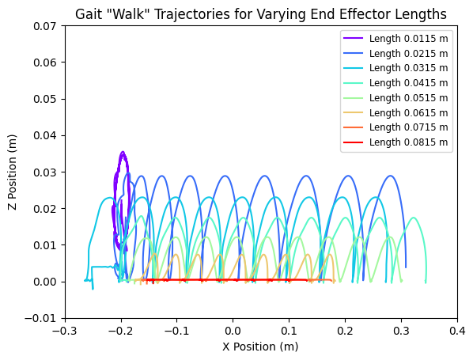
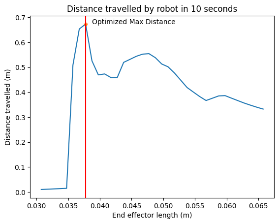

# Foldable Robotics — MuJoCo Simulation Studies

*Coursework · Fall 2024*

<p align="center">
  
  
  <br><em>Left: walking-gait foot trajectories for varying link lengths. Right: distance travelled vs. end-effector length, with the optimum marked.</em>
</p>


Two physics-simulation projects from a graduate Foldable Robotics course (RAS 557), both built in [MuJoCo](https://mujoco.org/). Each models a laminate/compliant mechanism, simulates its motion, and runs a design-optimization study. Both are fully self-contained — the simulations generate their own data, so the only dependency is MuJoCo.

## `bipedal-gait-study/` — bipedal walking mechanism

**`bipedal_gait_study.ipynb`** models a bipedal robot whose legs are two symmetric five-bar mechanisms, supported on a horizontal beam with a prismatic slider.

- Parameterized MuJoCo XML template (support height and end-effector link length are variables).
- A sinusoidal joint-controller generator that produces either a **walking** or **hopping** gait by phasing the four leg motors.
- Static testing (legs clear of the floor) to inspect end-effector trajectories, and dynamic testing (legs contacting the floor) to measure locomotion.
- **Optimization:** sweeps end-effector link length and uses `scipy.optimize.minimize` to find the length that maximizes distance travelled in 10 s.

*Team project — see Credits below.*

## `jump-height-optimization/` — compliant jumping leg

**`jump_height_optimization.ipynb`** models a cart on a wall with a servo-actuated compliant leg (2 links, 1 passive spring joint) that jumps by pushing off the ground.

- RC-servo model (torque from a PD voltage law, motor constants fit from the course textbook).
- Custom MuJoCo controller driving the leg joint.
- **Optimization two ways:** (1) a brute-force sweep of leg-spring stiffness `k` from 1e-3 to 1e1, plotting peak jump height vs. `k`; (2) a `scipy.optimize.minimize` search for the stiffness that maximizes jump height, with stability bounds.

## Run it

```bash
pip install -r requirements.txt
jupyter notebook
```

MuJoCo renders video via `mediapy`; on a headless machine set `MUJOCO_GL=egl` (or `osmesa`). Notebook outputs (including rendered videos) were cleared to keep the repo light — they regenerate on run.

## Credits

The bipedal-gait study was a **group project** (a team of three) completed for the *Foldable Robotics* class at ASU. The jump-height optimization is my individual work. The RC-servo model follows the course textbook.
